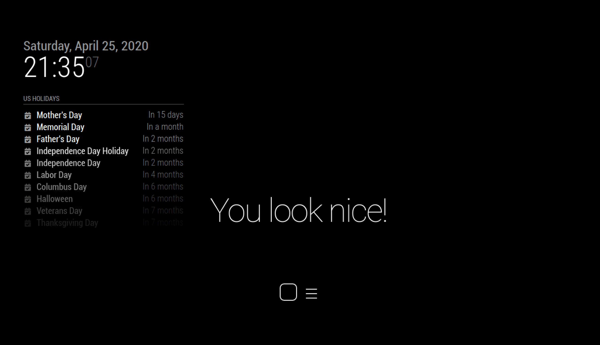
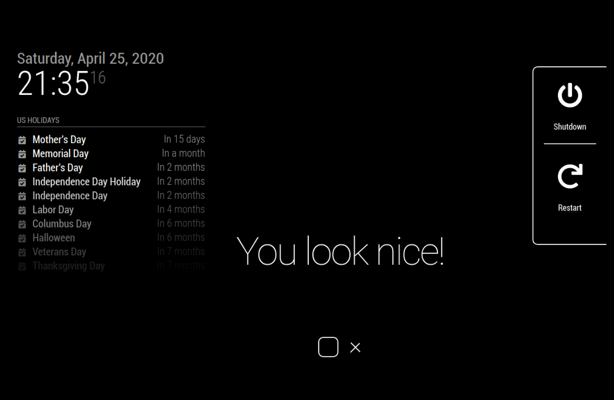
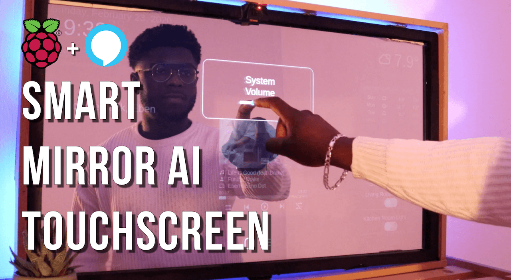

# MMM-SmartTouch

A module for controlling your [MagicMirror](https://github.com/MichMich/MagicMirror) using a
touchscreen interface project by [SmartBuilds.io](http:smartbuilds.io)

## How it works

This module allows you to transform your magic mirror into a touchscreen interactive experience.
This includes:

* **Standby Mode** - Hide all magic mirror modules and convert back to a normal mirror by pressing tne
  cycle button.
* **Side Menu** - Menu widget includes a _shutdown_ and _restart_ of Rpi to safely power down your mirror
  without unplugging and forced shutdowns (preventing SD card corruptions).

## Screenshots

|  |  |  |
|---|---|---|
| Menu option | Shutdown & Restart option | Transform back to mirror on Standby mode |

## View Demo of full integration



View full demo on [SmartBuilds.io](http:smartbuilds.io)

## Preconditions

* You will need a Interactive Touch screen peripheral such as an IR Frame or Capacitive Touch)
* MagicMirror<sup>2</sup> instance
* Node.js version >= 7
* npm

## Step 1 – Install the module

In your MagicMirror directory:

```bash 
cd modules
cd ~/MagicMirror/modules
git clone https://github.com/EbenKouao/MMM-SmartTouch.git
cd MMM-SmartTouch
npm install
```

## Step 2 – Add files to the Config.js

Here is an example for an entry in `config.js`

```javascript
{
  module: 'MMM-SmartTouch', 
  position: 'bottom_center',    // This can be any of the regions.(bottom-center Recommended)
  config:{ 
    // None configuration options defined 
  }
}
```

## Configuration options

None configuration options
